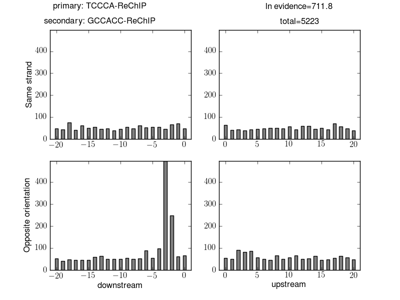

.. index:: scanning

Scanning for binding sites
==========================

As well as finding motifs, STEME is able to scan genomic sequences for instances of these motifs (putative transcription 
factor binding sites). To use STEME as a motif finder you can execute the following command::

  steme-pwm-scan --prediction-Z-threshold=.5 --lambda=.001 <motifs file> <input fasta sequence file>
  
which will create a file called ``steme-pwm-scan.out`` containing the positions of the putative binding sites and their scores.
The motifs file should be in minimal MEME format (STEME will output a file in this format called ``steme.txt``). The
``--prediction-Z-threshold`` option sets the minimum score for which predictions are reported. The ``--lambda`` option determines the
model hyper-parameter that dictates how likely binding sites are. Think of lambda as a per-base probability of a binding site so
``--lambda=.001`` states that *a priori* we expect one binding site per 1000 base pairs. Given this lambda, the Z score for
a motif instance can be read as the probability that this is a binding site for the transcription factor.

Large sequence sets
-------------------

STEME's PWM scanning algorithm is very efficient on large sequence sets due to its use of a suffix tree. In fact given enough memory
STEME can scan whole genomes for motif instances. If you are scanning 256 or fewer sequences some advantage can be gained by
defining the environment variable ``STEME_USE_GENOME_INDEX=1`` before running ``steme-pwm-scan``. STEME will use a different
genome optimised suffix tree with smaller memory requirements than the default one. In our experiments we found that scanning the mouse genome
required about 40Gb of main memory in this case. When STEME starts you will see a message detailing limits on the suffix tree in
terms of number of sequences, individual sequence length and total sequence length. The default suffix tree reports::

  Loaded standard version of STEME C++-python interface: max seqs=4294967296; max seq length=4294967296; max total length=4294967296

the genome optimised version reports::

  Loaded genome version of STEME C++-python interface: max seqs=256; max seq length=4294967296; max total length=4294967296

.. index:: scanning

Spacing analysis
----------------

Transcription factors can bind to DNA in complexes. Oftentimes their binding sites must be a fixed distance apart for these complexes 
to form. Given a set of putative transcription factor binding sites, STEME can analyse them for enriched spacings of pairs of motifs.
Highly enriched spacings suggest that a pair of transcription factors act in tandem::

  steme-spacing-analysis -d <distance> -t <threshold on log evidence>
  
will run STEME's spacing analysis method producing a list of results like:

Here we can see that instances of the pair of motifs ``TCCCA-ReChIP`` and ``GCCACC-ReChIP`` occurred 5,223 times at a distance of less
than 20 base pairs. There is an obvious enrichment where an instance of the reverse complement of ``GCCACC-ReChIP`` is 2
or 3 base pairs before an instance of ``TCCCA-ReChIP``. Given the 5,223 pairs of instances of these motifs the log evidence in favour
of an enriched distribution is large: 711.8.

Locating enriched pairs
-----------------------

Given that you have identified a pair of motifs that have some enriched spacing, you may wish to locate instances of the motifs
at this spacing. STEME provides a script to do just this::

  steme-find-spacings <spacing definitions file>

The spacing definitions file should contain a list of spacings that you are interested in. For example::

  TCCCA-ReChIP GCCACC-ReChIP C D 2
  TCCCA-ReChIP GCCACC-ReChIP C D 3

would find reverse complemented (``C``) instances of ``GCCACC-ReChIP`` 2 or 3 base pairs downstream (``D``)
of ``TCCCA-ReChIP`` instances.
