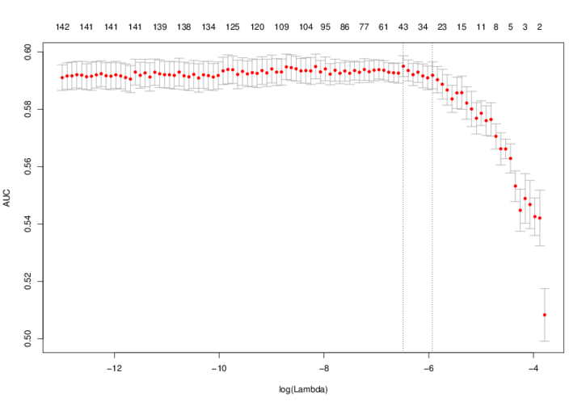

.. index:: scanning

Scanning for binding sites
==========================

As well as finding motifs, STEME is able to scan genomic sequences for
instances of these motifs (putative transcription factor binding sites). To use
STEME as a motif finder you can execute the following command::

  steme-pwm-scan --prediction-Z-threshold=.5 --lambda=.001 <motifs file> <input fasta sequence file>

which will create a file called ``steme-pwm-scan.out`` containing the positions
of the putative binding sites and their scores.  The motifs file should be in
minimal MEME format (STEME will output a file in this format called
``steme.txt``). The ``--prediction-Z-threshold`` option sets the minimum score
for which predictions are reported. The ``--lambda`` option determines the
model hyper-parameter that dictates how likely binding sites are. Think of
lambda as a per-base probability of a binding site so ``--lambda=.001`` states
that *a priori* we expect one binding site per 1000 base pairs. Given this
lambda, the Z score for a motif instance can be read as the probability that
this is a binding site for the transcription factor.

Scanning statistics
-------------------

STEME can analyse scans that are not too large in terms of number of sequences
or instances of motifs using various statistics::

  steme-scan-stats -r <scan directory>

will produce a HTML report of these statistics, plotting graphs for the
following:

- Site strengths: were the sites weak or strong?
- Site locations: did the sites show a positional bias towards the
  centre or the ends of the sequences?
- Number of sites per sequence: did some sequences have many more sites?
- Number of sites overall: how many sites were there for each motif?

Large sequence sets
-------------------

STEME's PWM scanning algorithm is very efficient on large sequence sets due to
its use of a suffix tree. In fact given enough memory STEME can scan whole
genomes for motif instances. If you are scanning 256 or fewer sequences some
advantage can be gained by defining the environment variable
``STEME_USE_GENOME_INDEX=1`` before running ``steme-pwm-scan``. STEME will use
a different genome optimised suffix tree with smaller memory requirements than
the default one. In our experiments we found that scanning the mouse genome
required about 40Gb of main memory in this case. When STEME starts you will see
a message detailing limits on the suffix tree in terms of number of sequences,
individual sequence length and total sequence length. The default suffix tree
reports::

  Loaded standard version of STEME C++-python interface: max seqs=4294967296;
  max seq length=4294967296; max total length=4294967296

the genome optimised version reports::

  Loaded genome version of STEME C++-python interface: max seqs=256;
  max seq length=4294967296; max total length=4294967296

.. index:: scanning

Spacing analysis
----------------

Transcription factors can bind to DNA in complexes. Oftentimes their binding
sites must be a fixed distance apart for these complexes to form. Given a set
of putative transcription factor binding sites, STEME can analyse them for
enriched spacings of pairs of motifs.  Highly enriched spacings suggest that a
pair of transcription factors act in tandem::

  steme-spacing-analysis -d <distance> -t <threshold on log evidence>
  
will run STEME's spacing analysis method producing a list of results like:

.. image:: _static/spacings-max=20-rank=020-TCCCA-ReChIP-GCCACC-ReChIP.png

Here we can see that instances of the pair of motifs ``TCCCA-ReChIP`` and
``GCCACC-ReChIP`` occurred 5,223 times at a distance of less than 20 base
pairs. There is an obvious enrichment where an instance of the reverse
complement of ``GCCACC-ReChIP`` is 2 or 3 base pairs before an instance of
``TCCCA-ReChIP``. Given the 5,223 pairs of instances of these motifs the log
evidence in favour of an enriched distribution is large: 711.8.

Locating enriched pairs
-----------------------

Given that you have identified a pair of motifs that have some enriched
spacing, you may wish to locate instances of the motifs at this spacing. STEME
provides a script to do just this::

  steme-find-spacings <spacing definitions file>

The spacing definitions file should contain a list of spacings that you are
interested in. For example::

  TCCCA-ReChIP GCCACC-ReChIP C D 2
  TCCCA-ReChIP GCCACC-ReChIP C D 3

would find reverse complemented (``C``) instances of ``GCCACC-ReChIP`` 2 or 3
base pairs downstream (``D``) of ``TCCCA-ReChIP`` instances.

.. index:: discrimination

Discriminating between scans
----------------------------

If you have the ``rpy2`` python package and the ``glmnet``, ``Matrix``,
``plyr`` and ``ROCR`` R packages installed, you can compare the results of two
scans to determine which motif instances best discriminate the sets of
sequences. The command::

  steme-scans-discriminate <sequence statistics 1> <sequence statistics 2>

will fit a lasso model using glmnet_ to the predicted binding sites and report
which motifs are selected by the model. These motifs are the motifs that
discriminate best between the two sequence sets. The model fitting uses
cross-validation to select a value of *lambda* (note this is a different lambda
than the lambda described above in the STEME scanning model). The output
directory will contain a plot demonstrating what AUC was achieved by this
*lambda*:

.. _glmnet: http://cran.r-project.org/web/packages/glmnet/index.html

The optimal *lambda* is shown by the vertical dotted line on the left and a
*lambda* which is within one standard error of the minimum is shown by the
vertical dotted line on the right. This *lambda.1se* is the value used
by the lasso.

The ROC curve for the performance of the lasso classifier on the training
data is also generated:

The program output will show the coefficients for the motifs in the lasso::

    2013-11-27 08:29:35,105 - INFO - Loading statistics from: scan-vertebrate-ac.csv
    2013-11-27 08:29:44,478 - INFO - Loading statistics from: scan-vertebrate-noac.csv
    2013-11-27 08:29:48,386 - INFO - Joining data
    2013-11-27 08:30:00,016 - INFO - Have 2169 motifs
    2013-11-27 08:30:00,017 - INFO - Have 5906 sequences
    2013-11-27 08:30:00,115 - INFO - 4.6% entries of X are non-zero
    2013-11-27 08:30:00,201 - INFO - Creating responses
    2013-11-27 08:30:00,204 - INFO - Cross-validating Lasso GLM
    2013-11-27 08:30:09,442 - INFO - Evaluating model
    2013-11-27 08:30:09,500 - INFO - AUC=0.599042
    2013-11-27 08:30:09,506 - INFO - Examine coefficients
    2013-11-27 08:30:09,513 - INFO - Using 19 / 2169 motifs
    2013-11-27 08:30:09,513 - INFO - beta: -0.871 : (Intercept)
    2013-11-27 08:30:09,513 - INFO - beta:  0.006 : E.V.NKX32_06.
    2013-11-27 08:30:09,513 - INFO - beta:  0.011 : E.V.GLI3_Q5_01.
    2013-11-27 08:30:09,513 - INFO - beta:  0.014 : E.V.OCT4_02.
    2013-11-27 08:30:09,514 - INFO - beta:  0.015 : E.V.SNAI2_01.
    2013-11-27 08:30:09,514 - INFO - beta:  0.016 : E.V.ASCL2_05.
    2013-11-27 08:30:09,514 - INFO - beta:  0.023 : E.V.ESRRA_03.
    2013-11-27 08:30:09,514 - INFO - beta:  0.036 : E.V.MAZ_Q6_01.
    2013-11-27 08:30:09,514 - INFO - beta:  0.052 : E.V.POU3F2_05.
    2013-11-27 08:30:09,514 - INFO - beta:  0.100 : E.V.SOX17_01.
    2013-11-27 08:30:09,514 - INFO - beta:  0.118 : E.V.POU5F1B_01.
    2013-11-27 08:30:09,514 - INFO - beta:  0.121 : E.V.FIGLA_01.
    2013-11-27 08:30:09,514 - INFO - beta:  0.133 : E.V.ZIC3_07.
    2013-11-27 08:30:09,514 - INFO - beta:  0.148 : E.V.ISX_04.
    2013-11-27 08:30:09,514 - INFO - beta:  0.196 : E.V.OCT4_01.
    2013-11-27 08:30:09,514 - INFO - beta:  0.205 : E.V.SOX2_01.
    2013-11-27 08:30:09,514 - INFO - beta:  0.228 : E.V.CACD_01.
    2013-11-27 08:30:09,514 - INFO - beta:  0.260 : E.V.TCF3_06.
    2013-11-27 08:30:09,514 - INFO - beta:  0.292 : E.V.ING4_01.
    2013-11-27 08:30:09,514 - INFO - beta:  0.359 : E.V.E2F3_Q6.
    2013-11-27 08:30:09,515 - INFO - Saving R workspace

This output shows that the most important motfs in the lasso were *E2F3*,
*ING4*, *TCF3* and *CACD* and that in total 19 motifs were used out of
a possible 2,169.

It is possible to run an elastic-net regularization instead of a lasso by using
the ``--alpha`` argument to the script. Please see the glmnet_ documentation
for more details.

If you wish to constrain the regression coefficients to positive values you can
use ``--lower-limits=0`` as an argument to the script. This can be useful when
you are interested in discriminating using motifs that occur in only one
of the scans. The example above was run with this argument, hence all the
coefficients are positive.
